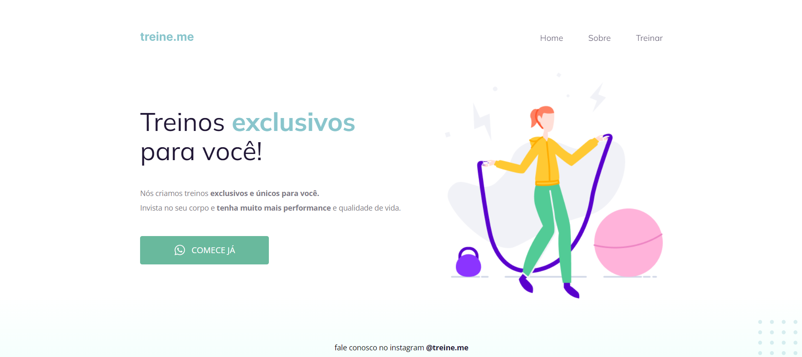

# 💻 Sobre o desafio

Sabemos que a maior parte do conteúdo disponível na internet hoje pode se tornar acessível apenas com a utilização **correta** dos elementos do HTML.

Você receberá um código com o projeto desenvolvido durante a Fase 02, mas, ao contrário do que foi feito em aula, ele **não** apresenta a semântica correta.
Como você pode ver na imagem abaixo, a página ~~(exceto o botão)~~ continua funcionando normalmente mas, quando você abrir o código, vai se deparar com os elementos do HTML todos bagunçados... **👀**

# 🎨 Layout do desafio

  

# 🎨 Layout do desafio finalizado

  

